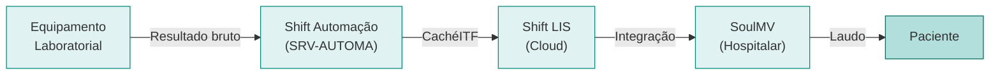

# Fluxo de Resultados

O fluxo de resultados laboratoriais percorre quatro etapas, desde a análise no equipamento até a disponibilização do laudo ao paciente.

## Diagrama

## Etapas

### 1. Equipamento Laboratorial

Os equipamentos (Cobas, XN, STA, etc.) realizam as análises e geram resultados numéricos e, em alguns casos, imagens (ex.: microscopia do Cobas 6500).

### 2. Shift Automação

O módulo de automação, hospedado no servidor SRV-AUTOMA, recebe os resultados via interface (CachéITF). Cada equipamento possui uma configuração de interfaceamento específica com porta, protocolo e mapeamento de exames.

### 3. Shift LIS

O sistema LIS (Laboratory Information System) recebe os resultados validados da automação. Aqui ocorre:

- Aplicação de regras de resultado (faixas de referência, alertas)
- Organização por máscara de exame (layout do laudo)
- Validação técnica pelo profissional responsável
- Liberação do resultado

### 4. SoulMV

O sistema hospitalar recebe o resultado via integração (Shift Integração) e o disponibiliza no prontuário do paciente. O SoulMV é a fonte definitiva para cadastro de pacientes e faturamento.

## Pontos de Atenção

!!! warning "Falhas comuns"

    - **Equipamento sem comunicação:** verificar interfaceamento no Shift Automação e conectividade do servidor
    - **Resultado não exporta para SoulMV:** verificar configuração de integração e status do usuário de exportação
    - **Laudo com layout incorreto:** verificar máscara no Shift LIS e espelho no SoulMV
